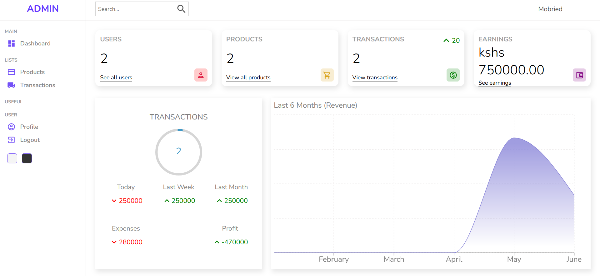
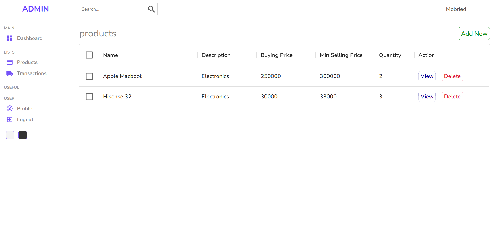
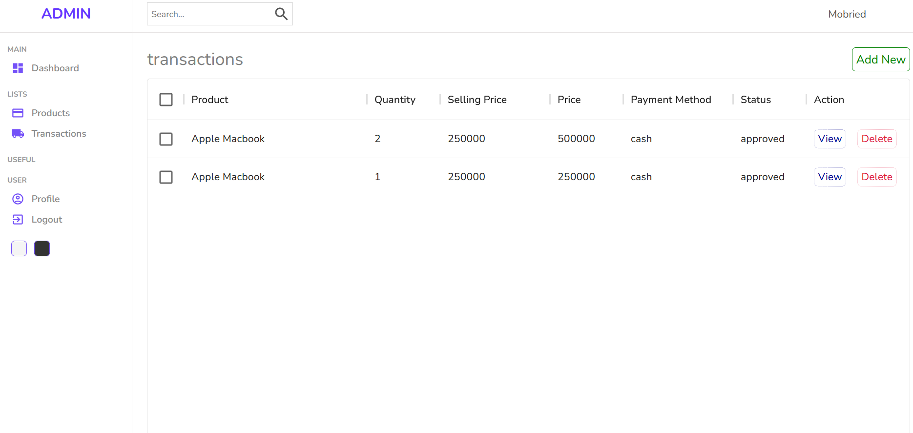
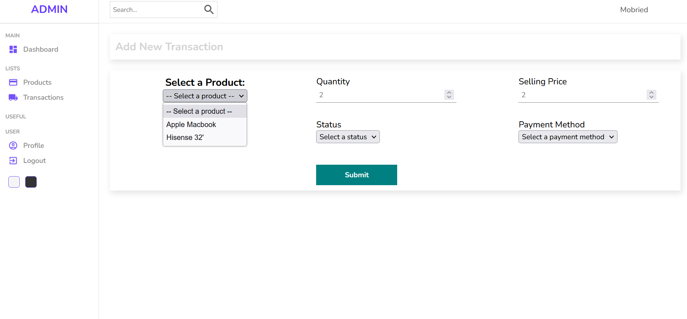
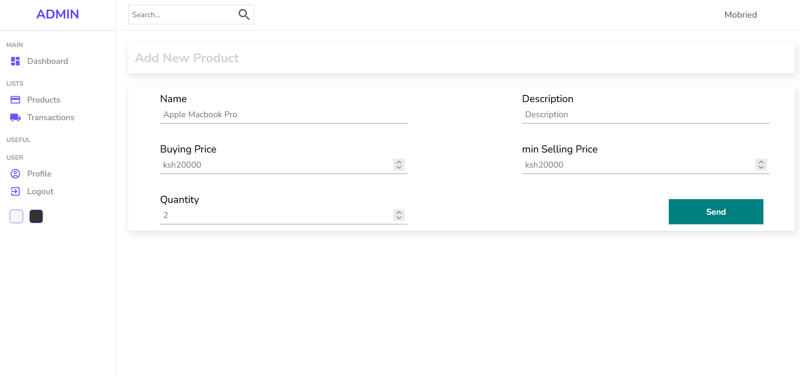

# ReactJs-NodeJs-Admin-Panel

This is a web application project for creating an admin panel that allows a user to add products and make transactions and view the monetary progress of their business using React.js and Node.js.

<div style="display: flex; justify-content: space-between;">
    
</div>

## Features

- User-friendly admin panel for a business
- CRUD operations for managing products and transactions
- Responsive and modern user interface built with React.js and Material-UI
- Interactive charts powered by recharts for data visualization

    <div style="display: flex; justify-content: center;">
        
        
    </div>
    <div style="display: flex; justify-content: center;">
        
        
    </div>

## Table of Contents

- [Installation](#installation)
- [Usage](#usage)
- [Features](#features)
- [Contributing](#contributing)
- [License](#license)

## Installation

1. Clone the repository:
git clone https://github.com/Eddychase/ReactJs-NodeJs-Admin-Panel.git


2. Install the dependencies:
cd ReactJs-NodeJs-Admin-Panel
npm install


## Usage

To start the project, run the following command:
npm start


The project will be available at http://localhost:3000.

## Features

- Create, read, update, and delete (CRUD) operations on data.
- Authentication and authorization using JWT tokens.
- Responsive design for desktop and mobile screens.
- Dashboard with analytics charts.

## Contributing

Contributions are welcome! Please open an issue or submit a pull request.To contribute, follow these steps:

1. Fork this repository.
2. Create a branch: `git checkout -b <branch_name>`
3. Make your changes and commit them: `git commit -m "<commit_message>"`
4. Push to the original branch: `git push origin ReactJS-NodeJs-Admin-Panel/master`
5. Create a pull request.

## License

This project is licensed under the MIT License.```


